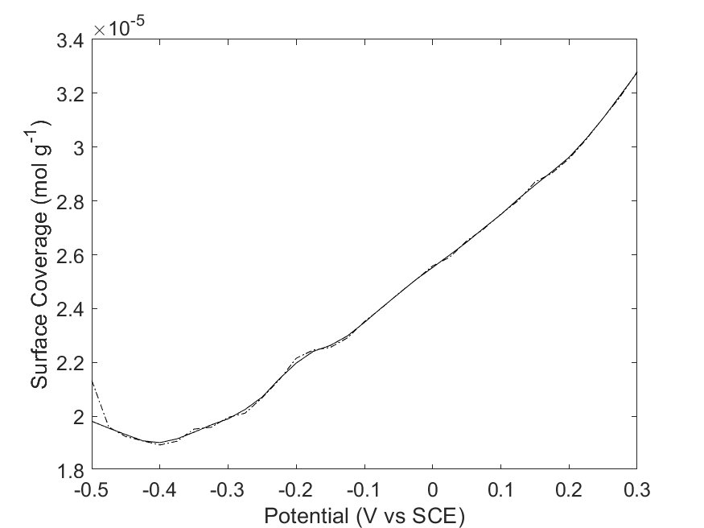

# electrochemical_analysis_scripts_matlab
Programs for the analysis of cyclic volammetry, step potential electrochemical spectroscopy, and electrochemical impedance spectroscopy results based on mathematical representations of the result types.

By folder:

1. CV contains cyclic voltammetry capacitance modelling programs, which can be used for set potential window:

or variable potential window analysis:

2. EIS contains electrochemical impedance spectroscopy modelling programs, which output for a mathematical EIS model specified in newby.m a range of results including capacitive, inductive, resistive, and mott-schottky behaviours:

3. SPECS contains programs related to step potential electrochemical spectroscopy, which produce results on capacitive performance, randles_sevcik style surface coverage by ions, and further materials characterstics.

